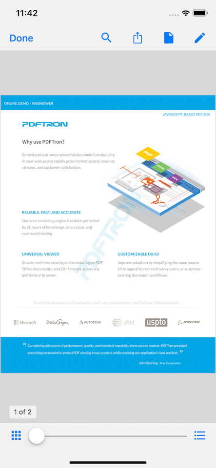
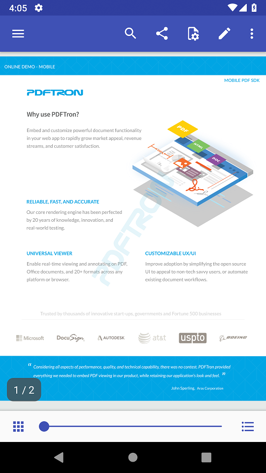
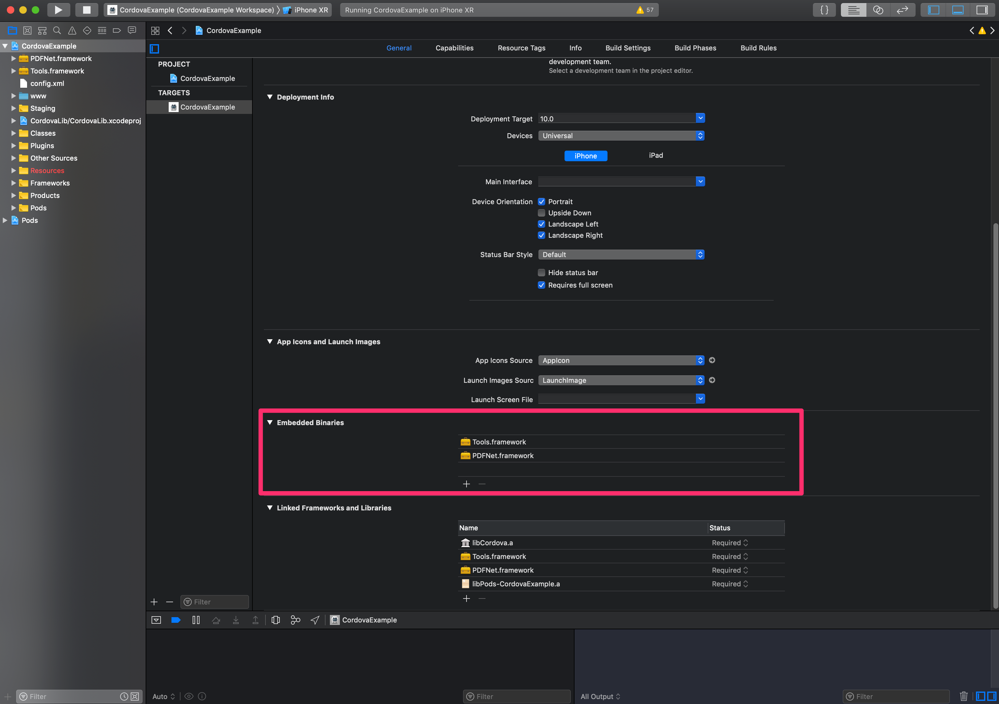
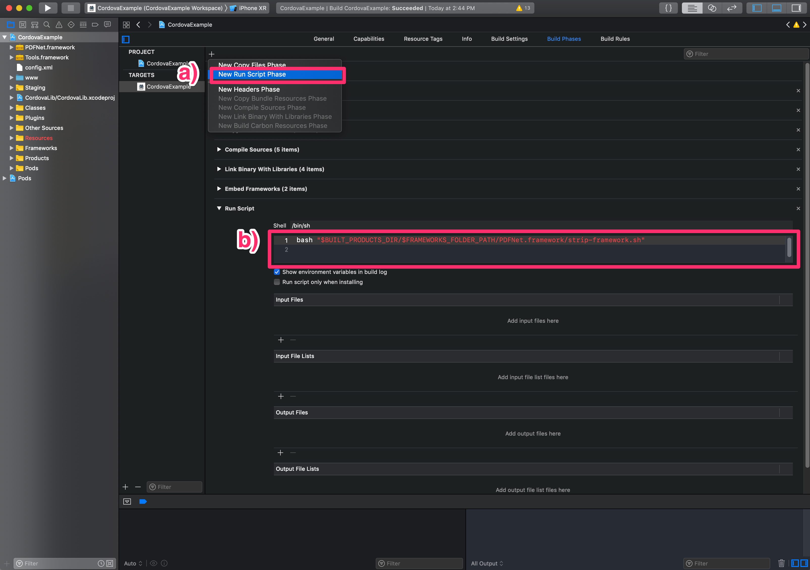

# pdftron-cordova

## This project is no longer in development. If you are looking for cross platform solution, check out [React Native](https://github.com/PDFTron/pdftron-react-native) or [Flutter](https://github.com/PDFTron/pdftron-flutter). If you are looking to add to your current Cordova/Ionic project, check out [WebViewer sample](https://github.com/PDFTron/webviewer-cordova-sample).

This repository contains PDFTron's native plugin for Cordova/Ionic. The plugin exposes a javascript interface for a full-featured PDF viewer and annotator with full native performance. 

The plugin can be used to present the PDF viewer either in full screen or over a specified rect (e.g. a &lt;div&gt;) defined in the HTML.

- [Prerequisites](#pre-requisites)
- [Preview](#preview)
- [Installation](#installation)
- [Usage](#usage)
- [API](#api)
- [License](#license)

## Pre-requisites
- No license key is requird for trial. However, a valid commercial license key is required after trial.
- The current version of the PDFTron SDK

## Preview

**iOS** |  **Android**
:--:|:--:
 | 

## Installation

### Add the plugin

1. The rest of this guide assumes your project is created by running `cordova create MyApp com.example.myapp MyApp`
2. Navigate to the root of your project, i.e. `MyApp`, and integrate the plugin with the terminal command:

    ```
    cordova plugin add https://github.com:PDFTron/pdftron-cordova.git
    ```

3. Call the following two lines to add the iOS and Android platforms:
    ```
    cordova platform add ios
    cordova platform add android
    ```
4. Follow the platform specific steps below.

### iOS

1. Download the PDFTron iOS SDK, [available here](https://www.pdftron.com/documentation/ios/get-started/integration/manually).

2. Open the .dmg, and copy the `/Lib` directory to an appropriate location for your project.

3. Drag the dynamic PDFNet and Tools frameworks (`Lib/Framework-dynamic/PDFNet.framework`, `Lib/Tools/Tools.framework`) into the "Embedded Binaries" section of your project, as indicated below.

     
    <center>The pink rectangle shows where to drag <code>PDFNet.framework</code> and <code>Tools.framework</code></center>

4. In your target's build phases:

    a) add a new run script phase (by clicking on the '+') \
    b) add the following script:
    ```
    bash "$BUILT_PRODUCTS_DIR/$FRAMEWORKS_FOLDER_PATH/PDFNet.framework/strip-framework.sh"
    ```
    This will ensure invalid slices are striped from the framework before being submitted to the app store (a [longstanding Xcode bug](http://www.openradar.me/radar?id=6409498411401216)).

    
    <center>Create a new run script phase, and add the text as shown.</center>


### Android

1. Add your PDFTron license key to `MyApp/platforms/android/gradle.properties` file.

    ```
    android.useAndroidX=true
    android.enableJetifier=true
    PDFTRON_LICENSE_KEY=INSERT_COMMERCIAL_LICENSE_KEY_HERE_AFTER_PURCHASE
    ```

2. Open `MyApp/platforms/android/app/src/main/java/com/example/myapp/MainActivity.java`, and change the base class to `CordovaAppCompatActivity`:

    ```diff
    -public class MainActivity extends CordovaActivity {
    +public class MainActivity extends CordovaAppCompatActivity {
    }
    ```

3. Open `MyApp/platforms/android/app/src/main/AndroidManifest.xml`, and change theme of `MainActivity` to `@style/CustomAppTheme`:

    ```diff
    -<activity android:name="MainActivity" android:theme="@android:style/Theme.DeviceDefault.NoActionBar" >
    +<activity android:name="MainActivity" android:theme="@style/CustomAppTheme" >
    ```
4. Add the following code to `index.html` and `index.js` as described [here](#usage).

5. After the changes, you will need to call the following to build and run the project:

    First, in `MyApp` directory call:

    ```bash
    cordova build android
    ```

    Then import the `MyApp/platforms/android` folder into Android Studio, and run the project from Android Studio using the play button. You will see a message that says `No Java files found that extend CordovaActivity.` . This message is okay to ignore since we're using CordovaAppCompatActivity.

    **Note:**
    When the project is first imported, Android Studio will complain about the minSdk. To resolve this, click `Move minSdkVersion to build files and sync project` in the error window.

## Usage

Add a viewer div in your `index.html`:
```html
<body>
    <div class="app">
        <div id="viewer"></div>
        <div id="deviceready" class="blink">
            <p class="event listening">Connecting to Device</p>
            <p class="event received">Device is Ready</p>
        </div>
    </div>
</body>
```

Replace `index.js` with the following:

```js
/*
 * Licensed to the Apache Software Foundation (ASF) under one
 * or more contributor license agreements.  See the NOTICE file
 * distributed with this work for additional information
 * regarding copyright ownership.  The ASF licenses this file
 * to you under the Apache License, Version 2.0 (the
 * "License"); you may not use this file except in compliance
 * with the License.  You may obtain a copy of the License at
 *
 * http://www.apache.org/licenses/LICENSE-2.0
 *
 * Unless required by applicable law or agreed to in writing,
 * software distributed under the License is distributed on an
 * "AS IS" BASIS, WITHOUT WARRANTIES OR CONDITIONS OF ANY
 * KIND, either express or implied.  See the License for the
 * specific language governing permissions and limitations
 * under the License.
 */
var app = {
    // Application Constructor
    initialize: function() {
        document.addEventListener('deviceready', this.onDeviceReady.bind(this), false);
    },

    // deviceready Event Handler
    //
    // Bind any cordova events here. Common events are:
    // 'pause', 'resume', etc.
    onDeviceReady: function() {
        this.receivedEvent('deviceready');
    },

    onTopLeftButtonPressed: function () {
      console.log('onTopLeftButtonPressed');
    },

    // Update DOM on a Received Event
    receivedEvent: function(id) {
        var parentElement = document.getElementById(id);
        var listeningElement = parentElement.querySelector('.listening');
        var receivedElement = parentElement.querySelector('.received');

        listeningElement.setAttribute('style', 'display:none;');
        receivedElement.setAttribute('style', 'display:block;');

        console.log('Received Event: ' + id);

        var viewerElement = document.getElementById('viewer');
        var viewer = new PDFTron.NativeViewer({
          l: '<your-key-here>',
          initialDoc: 'https://pdftron.s3.amazonaws.com/downloads/pl/PDFTRON_mobile_about.pdf',
          disabledElements: [
            // hide elements as you wish
          ]
        }, viewerElement);

        document.addEventListener("topLeftButtonPressed", this.onTopLeftButtonPressed.bind(this), false);
    }
};

app.initialize();
```

## API

### new NativeViewer(options, element)

Creates a NativeViewer and embeds it on the HTML page.

#### Parameters

#### options

Options passed to the NativeViewer, available options are:
- `initialDoc`: string, optional - the URL path to a document to load on startup
- `l`: string, optional - the PDFTron license key
- `disabledElements`: array of string, optional - hides multiple elements in the viewer, see `disableElements` for list of available options
- `boundingRect`: object, optional - the bounding box for where NativeViewer should be embedded. If no `boundingRect` is provided, the viewer will be presented full screen.
- `topLeftButtonTitle`: string, optional - the menu item for top left navigation button, shown as icon on Android and text on iOS, available options are: `menu`, `close`, `back`
- `showTopLeftButton`: boolean, optional - whether to show the top left navigation button

Type | Required | Default
--- | --- | ---
object | true | N/A

#### element

An html element. If an element is provided, the viewer will be added at the location specified by `boundingRect`. (If no `boundingRect` is provided, on iOS the viewer will be presented directly over the element itself, and on Android the viewer will be presented full screen.) If no element is provided, the API [`showDocumentViewer()`](#showdocumentviewer) must be used to show the viewer.

Type | Required | Default
--- | --- | ---
string | false | N/A

#### Example
```
var viewerElement = document.getElementById('viewer');
var rect = viewerElement.getBoundingClientRect();
var viewer = new PDFTron.NativeViewer({
    l: '<your-key-here>',
    initialDoc: 'https://pdftron.s3.amazonaws.com/downloads/pl/PDFTRON_mobile_about.pdf',
    boundingRect: { left: rect.left, top: rect.top, width: rect.width, height: rect.height },
    disabledElements: [
    // hide elements as you wish
    ]
}, viewerElement);
```

### disableElements(dataElements)

Hides multiple elements in the viewer, available options are:
* viewControlsButton
* freeHandToolButton
* highlightToolButton
* underlineToolButton
* squigglyToolButton
* strikeoutToolButton
* rectangleToolButton
* ellipseToolButton
* lineToolButton
* arrowToolButton
* polylineToolButton
* polygonToolButton
* cloudToolButton
* signatureToolButton
* freeTextToolButton
* stickyToolButton
* calloutToolButton
* stampToolButton
* toolsButton
* searchButton
* shareButton
* thumbnailsButton
* listsButton
* moreItemsButton
* thumbnailSlider

#### Parameters

#### dataElements
Array of element keys.

Type | Required | Default
--- | --- | ---
array of string| true | N/A

#### Example

```javascript
// remove search button and line create tool
this.viewer.disableElements([ 'searchButton', 'lineToolButton' ]);
```

### disableTools(toolNames)

Disable multiple tools.

#### Parameters

#### toolNames
Array of name of the tools, available options are:
- AnnotationEdit
- TextSelect
- AnnotationCreateSticky
- AnnotationCreateFreeHand
- AnnotationCreateTextHighlight
- AnnotationCreateTextUnderline
- AnnotationCreateTextSquiggly
- AnnotationCreateTextStrikeout
- AnnotationCreateFreeText
- AnnotationCreateCallout
- AnnotationCreateSignature
- AnnotationCreateLine
- AnnotationCreateArrow
- AnnotationCreatePolyline
- AnnotationCreateStamp
- AnnotationCreateRectangle
- AnnotationCreateEllipse
- AnnotationCreatePolygon
- AnnotationCreatePolygonCloud
- AnnotationCreateDistanceMeasurement
- AnnotationCreatePerimeterMeasurement
- AnnotationCreateAreaMeasurement

Type | Required | Default
--- | --- | ---
array of string | false | all tools

#### Example
```javascript
// enable sticky annotation tool and free text tool
this.viewer.disableTools([ 'AnnotationCreateSticky', 'AnnotationCreateFreeText' ]);
```

### enableTools(toolNames)

Enable multiple tools that were previously disabled.

#### Parameters

#### toolNames
Array of name of the tools, available options are:
- AnnotationEdit
- TextSelect
- AnnotationCreateSticky
- AnnotationCreateFreeHand
- AnnotationCreateTextHighlight
- AnnotationCreateTextUnderline
- AnnotationCreateTextSquiggly
- AnnotationCreateTextStrikeout
- AnnotationCreateFreeText
- AnnotationCreateCallout
- AnnotationCreateSignature
- AnnotationCreateLine
- AnnotationCreateArrow
- AnnotationCreatePolyline
- AnnotationCreateStamp
- AnnotationCreateRectangle
- AnnotationCreateEllipse
- AnnotationCreatePolygon
- AnnotationCreatePolygonCloud
- AnnotationCreateDistanceMeasurement
- AnnotationCreatePerimeterMeasurement
- AnnotationCreateAreaMeasurement

Type | Required | Default
--- | --- | ---
array of string | false | all tools

#### Example
```javascript
// enable sticky annotation tool and free text tool
this.viewer.disableElements([ 'AnnotationCreateSticky', 'AnnotationCreateFreeText' ]);
```

### setToolMode(toolName)
Sets tool mode.

#### Parameters

#### toolName
Name of the tool, available options are:
- AnnotationEdit
- TextSelect
- AnnotationCreateSticky
- AnnotationCreateFreeHand
- AnnotationCreateTextHighlight
- AnnotationCreateTextUnderline
- AnnotationCreateTextSquiggly
- AnnotationCreateTextStrikeout
- AnnotationCreateFreeText
- AnnotationCreateCallout
- AnnotationCreateSignature
- AnnotationCreateLine
- AnnotationCreateArrow
- AnnotationCreatePolyline
- AnnotationCreateStamp
- AnnotationCreateRectangle
- AnnotationCreateEllipse
- AnnotationCreatePolygon
- AnnotationCreatePolygonCloud
- AnnotationCreateDistanceMeasurement
- AnnotationCreatePerimeterMeasurement
- AnnotationCreateAreaMeasurement

Type | Required | Default
--- | --- | ---
string | true | N/A

#### Example
```javascript
// sets the current tool mode to freehand inking
this.viewer.setToolMode('AnnotationCreateFreeHand');
```

### setPagePresentationMode(mode)
Sets the page presentation mode.

#### Parameters

#### mode
Name mode, available options are:
- SinglePage
- SingleContinous
- Facing
- FacingContinous
- FacingCover
- FacingContinousCover

Type | Required | Default
--- | --- | ---
string | true | N/A

#### Example
```javascript
// sets the viewer to single page continuous
this.viewer.setPagePresentationMode('SingleContinous');
```

### loadDocument(documentPath)
Load a document inside NativeViewer UI.

#### Parameters

#### documentPath
Path to the document.

Type | Required | Default
--- | --- | ---
string | true | N/A

#### Example

```javascript
this.viewer.loadDocument('https://pdftron.s3.amazonaws.com/downloads/pl/PDFTRON_mobile_about.pdf');
```

### showDocumentViewer()
Shows a previously constructed NativeViewer.

If a `boundingRect` is defined, the viewer will be displayed on top of the web content within the specified rect. If no `boundingRect` is defined, the viewer will be presented full screen.

#### Example
```javascript
this.viewer.showDocumentViewer();
```

### save
Saves the document.

### Example

```javascript
this.viewer.save(function (s) {
    // "s" is the location of the file on the device
    console.log(s);
}, function (e) {
    console.log("Error saving file " + e);
});
```

## Contributing
See [Contributing](./CONTRIBUTING.md)

## License
See [License](./LICENSE)

